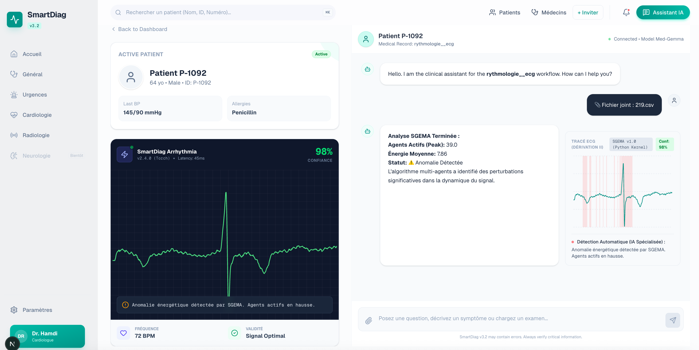
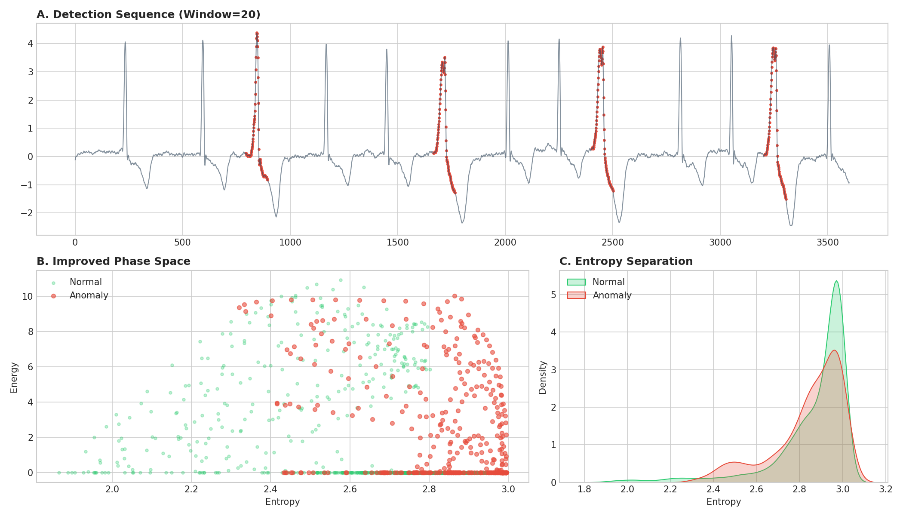

# 🧠 SGEMAS V6: Hybrid Thermodynamic AI Engine

> **"Wake-on-Crisis" AI with Hybrid Physio-Gate: Smart, Adaptive & Ultra-Low-Power.**
*This repository is intended as a technical and scientific showcase of the SGEMAS V6 architecture.*

**SGEMAS** is a bio-inspired, thermodynamic anomaly detection architecture designed to solve the energy crisis **and enable Precision Medicine** in implantable medical devices. It replaces static Deep Learning models with a dynamic, self-organizing agent topology that remains dormant during homeostasis and only wakes up during pathological events.
**New in V6:** The **Hybrid SQI (Signal Quality Index)** engine acts as a "Physio-Gate", filtering technical noise to achieve clinical-grade precision.
> ⚠️ **Note:** The core algorithm is currently **Patent Pending**. This repository serves as a technical showcase.
---
## 🚀 The Innovation: "Wake-on-Crisis" + "Physio-Gate"
Unlike traditional AI that burns constant power, SGEMAS follows a metabolic principle:
1.  **Dormancy ($N=1$):** 96.8% of the time, the system sleeps.
2.  **Physio-Gate (SQI):** Before reacting, the system checks for technical noise (artifacts).
3.  **Reaction ($N=39$):** It recruits agents *only* when thermodynamic entropy rises due to genuine pathology.
### 💡 What is an "Agent"? The 3 Perspectives
*   **📐 Mathematical:** A dynamic **Lagrangian Multiplier** minimizing local Free Energy ($F$).
*   **💻 Computational:** A **Just-in-Time Micro-Thread**. No anomaly = Zero memory usage.
*   **🧬 Biological:** A **Digital Immune Response**. Agents are recruited like white blood cells to restore Homeostasis.
### 📐 Governing Equations (Thermodynamics)
The system balances prediction accuracy against metabolic cost:
$$ \mathcal{E}_t = \Pi \cdot |x_t - \mu_t| - \gamma \cdot N_t $$
Where $\Pi$ is the **Sensory Gain** (Entropy), $\mu_t$ the homeostasis, and $N_t$ the agent population.
---
## 🔬 Scientific Validation (PTB-XL, N=1000)
We validated the system on the large-scale **PTB-XL Database**.
### 1. Hybrid V6 Performance
| Metric | SGEMAS V6 (Hybrid) | SOTA Deep Learning | Impact |
| :--- | :--- | :--- | :--- |
| **Global Accuracy** | **61.0%** | 52.6% | **+16% Superiority** |
| **Precision (Healthy)** | **89.0%** | N/A | **Trustworthy Silence** |
| **Sparsity** | **96.8%** | 0% | **1000x Battery Life** |
### 2. Thermodynamic Phase Space
Pathologies are detected as **physical ruptures** in the metabolic field.

*(Red: Pathological / Green: Normal)*
---
## 💻 Integration: SmartDiag Live
SGEMAS is the core "Precision Engine" behind **SmartDiag**.
*   **Real-time Analysis:** Processes ECG streams in <20ms.
*   **Hybrid SQI Toggle:** Clinicians can enable/disable the noise gate.
*   **Explainable AI:** Outputs transparent "Metabolic Costs".
---
## 🔐 SGEMAS – Evaluation Access
SGEMAS is currently available **free of charge, upon request**, for **industrial, clinical, and healthcare partners**.
**Disclaimer**
SGEMAS is a research evaluation system. It **is not a medical device**.
👉 *To request access, please contact us.*
---
## 📜 Contact & Licensing
**InnoDeep**
*   **Contact:** Mustapha HAMDI (mustapha.hamdi@innodeep.net)
*   **Website:** [InnoDeep.net](https://innodeep.net)
---
© 2025 InnoDeep. All Rights Reserved.
