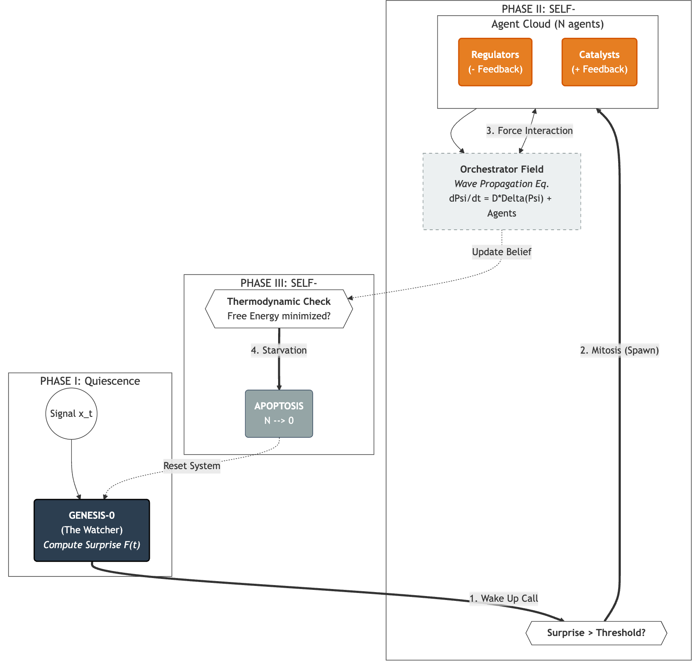
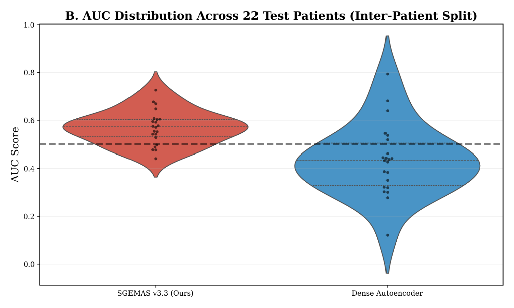

# SGEMAS: Self-Growing Ephemeral Multi-Agent System

**Official Implementation for the paper:**  
*"SGEMAS: A Self-Growing Ephemeral Multi-Agent System for Unsupervised Online Anomaly Detection via Entropic Homeostasis"*

## Overview
SGEMAS is a bio-inspired anomaly detection framework that treats intelligence as a thermodynamic process. Instead of a static neural network, it uses a dynamic population of agents that grow (mitosis) and die (apoptosis) based on the metabolic cost of tracking the signal.

This repository contains the canonical implementation of **SGEMAS v3.3**, which achieves an AUC of **0.570** on the MIT-BIH Arrhythmia Database (Inter-patient split DS2) in a fully unsupervised, zero-shot regime.

## Key Features
*   **Unsupervised:** No labels required.
*   **Online:** Processes data stream-wise (sample by sample).
*   **Energy-Efficient:** "Wake-on-crisis" architecture; agents only exist when the signal is anomalous.
*   **Interpretable:** The metabolic energy $E(t)$ serves as a direct biomarker for pathology.

## System Architecture
SGEMAS treats the agent population as a thermodynamic field. Agents are spawned when prediction error (Free Energy) is high and die when homeostasis is restored.



## Mathematical Formulation
The system minimizes a **Metabolic Lagrangian**:
$$ \mathcal{L}_t = \frac{|x_t - \mu_t|}{\Pi_t} + \beta N_t $$
Where:
*   $|x_t - \mu_t|$ is the variational free energy (surprise).
*   $\Pi_t$ is the adaptive precision (inverse variance).
*   $\beta N_t$ is the metabolic cost of maintaining $N$ agents.

**Structural Plasticity (Birth/Death):**
*   **Mitosis (Birth):** $\text{if } E_t > E_{\text{thresh}} \implies N_{t+1} = N_t + 1$
*   **Apoptosis (Death):** $\text{if } E_t < E_{\text{crit}} \implies N_{t+1} = N_t - 1$

## Results (MIT-BIH Arrhythmia Database)
We validated SGEMAS v3.3 on the inter-patient test set (DS2, 22 records).
*   **Mean AUC:** 0.570 (vs 0.502 for baseline).
*   **Statistical Significance:** p = 0.0275 (Wilcoxon signed-rank test).



## Synthetic Validation
The system correctly identifies anomalies as "thermodynamic singularities" (energy spikes) in a controlled environment.


## Usage

```python
from sgemas import SGEMAS_v33

# Initialize model
model = SGEMAS_v33()

# Process a signal stream
scores = []
for x in signal:
    out = model.process(x)
    scores.append(out['anom_score'])
```

## Citation
If you use this code, please cite our paper:
```bibtex
@article{hamdi2025sgemas,
  title={SGEMAS: A Self-Growing Ephemeral Multi-Agent System...},
  author={Hamdi, Mustapha},
  journal={Proceedings of...},
  year={2025}
}
```
