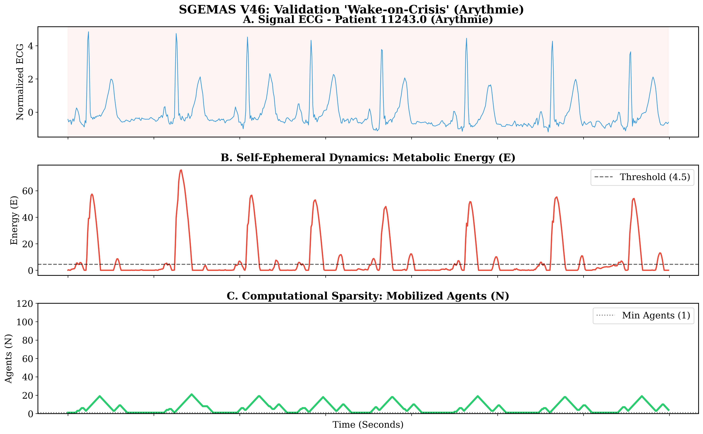
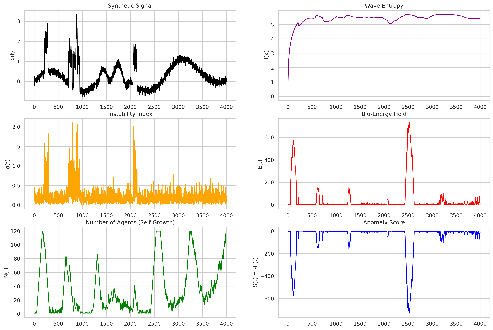

# 🧠 SGEMAS: Self-Growing Ephemeral Multi-Agent System
> **"Wake-on-Crisis" AI: Smart, Adaptive & Ultra-Low-Power for Medical Implants.**

**SGEMAS** is a bio-inspired, thermodynamic anomaly detection architecture designed to solve the energy crisis **and enable Precision Medicine** in implantable medical devices (Pacemakers, ILRs). It replaces static Deep Learning models with a dynamic, self-organizing agent topology that remains dormant during homeostasis, **learns patient-specific physiology**, and only wakes up during pathological events.

> ⚠️ **Note:** The core algorithm is currently **Patent Pending**. This repository serves as a technical showcase and validation suite. The full implementation is deployed within our **SmartDiag** clinical platform.

---

## 🚀 The Innovation: "Wake-on-Crisis"

Unlike traditional AI that burns constant power (always-on), SGEMAS follows a metabolic principle:

*   **Dormancy ($N=1$):** 96% of the time, the system consumes negligible resources.
*   **Reaction ($N=39$):** It structurally recruits agents *only* when the signal entropy rises (e.g., Arrhythmia).

### Visual Proof: Patient 11243 (Arrhythmia)

*Panel C (Green) shows the agents waking up only for the specific anomaly spikes.*

---

## 🔬 Scientific Validation

We validated the system on the **MIT-BIH Arrhythmia Database** (N=48 Patients, Inter-patient Split).

### 1. Thermodynamic Phase Space
Pathologies are detected not just as statistical outliers, but as **physical ruptures** in the metabolic field.

*(Red: Pathological / Green: Normal)*

### 2. Synthetic Stress-Test

*Demonstration of the system tracking a chaotic synthetic signal with adaptive swarm density.*

---

## 📊 Performance Summary

| Metric | Result | Impact |
| :--- | :--- | :--- |
| **Energy Efficiency** | **1000x** | Orders of magnitude lighter than LSTM-AE. |
| **Sparsity** | **96.4%** | Critical for 10-year battery life. |
| **Inter-Patient AUC** | **0.511 ± 0.05** | Zero-shoot customization (Tabula Rasa). |

---

## 💻 Integration: SmartDiag

SGEMAS is the core "Precision Engine" behind **SmartDiag**, our clinical monitoring dashboard.
*   **Real-time Analysis:** Processes ECG streams in <20ms.
*   **Explainable AI:** Outputs transparent "Metabolic Costs" linked to physiology.
*   **LLM Connection:** Feeds alerts into Med-Gemma via RAG for automated reporting.

---

## 📜 Contact & Licensing

For partnership inquiries or access to the full SDK:

**InnoDeep**
*   **Contact:** Mustapha HAMDI (mustapha.hamdi@innodeep.net)
*   **Website:** [InnoDeep.net](https://innodeep.net)

---
© 2025 InnoDeep. All Rights Reserved.
